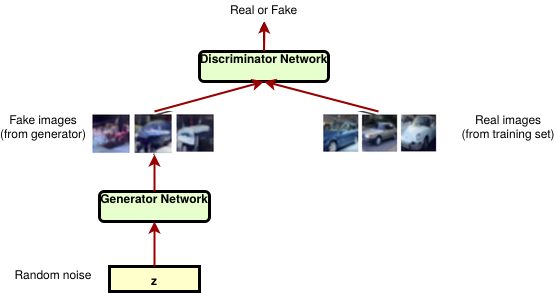
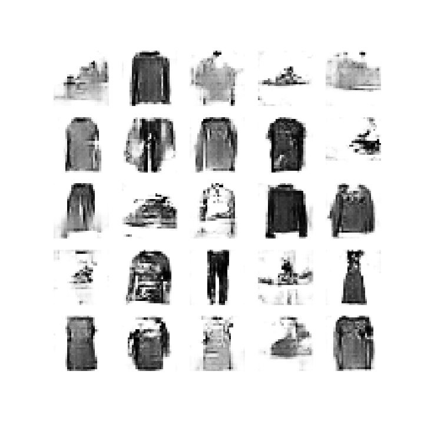

# DCGANs
## Generate Synthetic Images with DCGANs in Keras

## Welcome!
Welcome to **Generate Synthetic Images with DCGANs in Keras**. This project is based on Deep Convolutional Generative Adversarial Network (DCGAN).

[Generative Adversarial Networks](https://arxiv.org/abs/1406.2661) (GANs) are one of the most interesting ideas in computer science today. Two models are trained simultaneously by an adversarial process. A generator ("the artist") learns to create images that look real, while a discriminator ("the art critic") learns to tell real images apart from fakes.

During training, the generator progressively becomes better at creating images that look real, while the discriminator becomes better at telling them apart. The process reaches equilibrium when the discriminator can no longer distinguish real images from fakes.

This notebook demonstrates this process on the **FASHION_MNIST** dataset. The following animation shows a series of images produced by the generator as it was trained for **10 epochs**. The images begin as random noise, and increasingly resemble over time.

